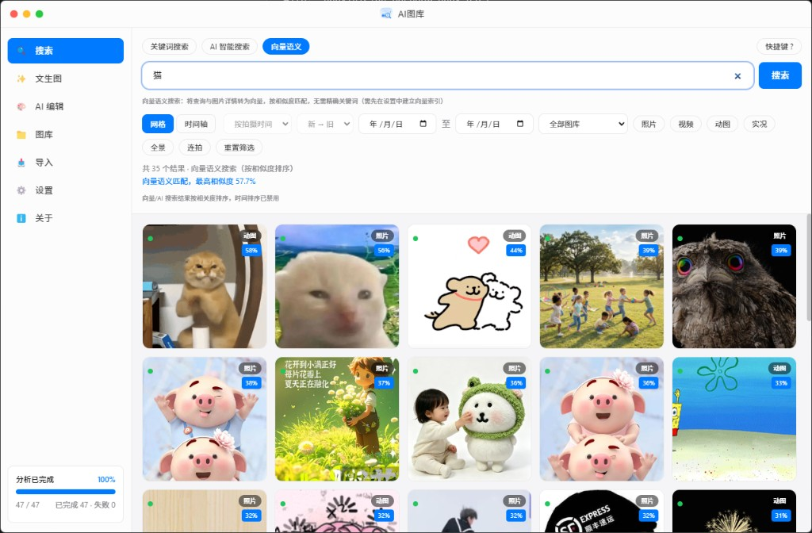
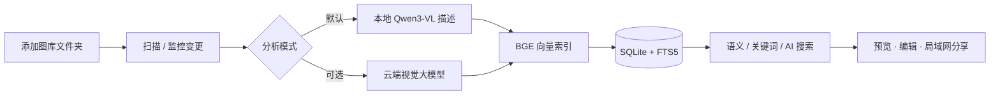

<div align="center">

# AI图库 · YourPicture

**用自然语言管理本地照片 — 默认零 API 费用，隐私留在本机**

Windows 桌面智能图库 · 本地 Qwen3-VL 理解 + BGE 语义检索 · 可选云端增强

[](package.json)
[](package.json)
[](config/LICENSE.txt)
[](package.json)
[](package.json)

[快速开始](#-快速开始) · [功能亮点](#-核心亮点) · [界面预览](#-界面预览) · [用户指南](docs/USER_GUIDE.md) · [更新日志](docs/archive/CHANGELOG.md)

</div>

---

## 一句话

导入文件夹 → **本地 AI 自动写描述、打标签、建向量索引** → 用「海边日落」「穿红裙子的猫」这类话直接搜图，不必再维护文件夹名或相册标签。

适合：**几万张散落硬盘的照片**、家庭相册、设计素材库、旅行成片 — 不想把原图上传到网盘 AI 的人。

---

## 核心亮点

| 能力 | 说明 |
|------|------|
| **本地优先，零 token 建库** | 默认用本机 ONNX（Qwen3-VL + BGE 中文）完成分析与向量，扫描图库不消耗大模型 API |
| **三种搜索方式** | 关键词 FTS · **向量语义**（理解画面含义）· AI 智能匹配 |
| **可选云端增强** | 人物 / IP / 梗图等难例，一键用 DashScope 等 OpenAI 兼容 API 重新分析 |
| **真·图库工作流** | 多目录监控、增量扫描、GIF/视频抽帧、实况/连拍、EXIF 与拍摄地 |
| **创作与协作** | 文生图、指令修图、局域网传图（手机扫码上传/下载） |
| **配置驱动** | 模型清单 `config/local-models.json`、提示词 `prompts/`，无硬编码型号 |

---

## 界面预览

输入 **「猫」** 进行向量语义搜索 — 无需文件名含「猫」，按画面与 AI 描述的相似度排序（缩略图角标为相似度）：



<details>
<summary>界面还能做什么</summary>

- 网格 / 时间轴、按拍摄时间筛选、按图库与媒体类型过滤  
- 侧栏实时显示分析进度，完成后即可语义检索  
- 结果可包含真实猫咪、卡通、玩偶等「概念相近」内容（由向量相似度决定，非简单关键词）  

</details>

---

## 工作原理



---

## 与常见方案对比

|  | 系统相册 / 资源管理器 | 网盘「以图搜图」 | **AI图库** |
|--|---------------------|----------------|------------|
| 数据位置 | 本地 | 多需上传云端 | **本地为主** |
| 自然语言搜图 | 弱或无 | 有 | **有（向量 + FTS）** |
| 批量 AI 理解 | 无 | 视产品而定 | **默认本地 ONNX** |
| API 费用 | — | 会员 / 按量 | **建库可零 token** |
| Windows 桌面 | ✓ | 多为网页 | **Electron 原生** |

---

## 快速开始

### 环境

- **Windows 10/11**（x64）  
- **Node.js 20 LTS**（开发 / 自行打包时）  
- 本地分析建议 **16GB+ 内存**，首次需下载约 **4.5GB** 描述模型 + **~100MB** 向量模型  

### 开发运行

```bash
git clone <你的仓库地址>
cd PictureSearch
npm install
npm run dev
```

首次启动：打开 **设置 → 本地端侧分析**，下载 **Qwen3-VL 2B**（推荐）与 **BGE 中文向量**。  
无法访问 Hugging Face 时，在设置中填写镜像：`https://hf-mirror.com`（公开 ONNX 模型一般**无需 HF 账号**）。

### 打包安装包

```bash
npm run pack
```

安装包输出在 `release/`，产品名 **AI图库**。模型默认缓存在 **安装目录下的 `models/`**（非 C 盘 AppData）。

---

## 本地模型（可配置）

型号由 [`config/local-models.json`](config/local-models.json) 注册，升级型号无需改业务代码：

| 模型 | 用途 | 体积（约） |
|------|------|------------|
| **Qwen3-VL 2B**（默认推荐） | 画面描述、结构化 JSON 字段 | ~4.5GB |
| Qwen2.5-VL 3B | OCR / 细节更强 | ~5.5GB |
| BGE-small-zh | 中文语义向量 | ~100MB |

云端增强需自行配置 OpenAI 兼容 API（如阿里云 DashScope `qwen3.5-plus`），详见 [用户指南](docs/USER_GUIDE.md)。

---

## 技术栈

<p>
  
  
  
  
  
  
</p>

Electron · React · TypeScript · better-sqlite3 (FTS5) · @huggingface/transformers 4.x · Sharp · FFmpeg · OpenAI SDK

架构与模块说明见 [设计文档](docs/DESIGN.md)。

---

## 文档

| 文档 | 说明 |
|------|------|
| [用户指南](docs/USER_GUIDE.md) | 安装、配置、建库、搜索、云端增强 |
| [设计文档](docs/DESIGN.md) | 架构与数据流 |
| [开发计划](docs/DEV_PLAN.md) | 路线图 |
| [CHANGELOG](docs/archive/CHANGELOG.md) | 版本记录 |
| [待办](docs/todo.md) | 已知问题与计划 |

---

## 参与与反馈

如果这个项目对你有用，欢迎 **Star** 支持一下，让更多人发现「本地 AI 图库」这条路。

- Bug / 功能建议：提交 **Issue**（附系统版本、复现步骤、日志片段）  
- 改进代码：Fork → 分支 → PR，请保持改动聚焦、遵循现有目录与 `config/` 配置约定  

---

## 说明

- 产品显示名：**AI图库**  
- 用户配置与数据库：`%APPDATA%/YourPicture`（历史兼容目录名）  
- 当前版本：**v1.8.1** — 本地推理子进程（UI 不阻塞）、端侧分析、向量索引、局域网传图  

## 许可证

[MIT](config/LICENSE.txt)
